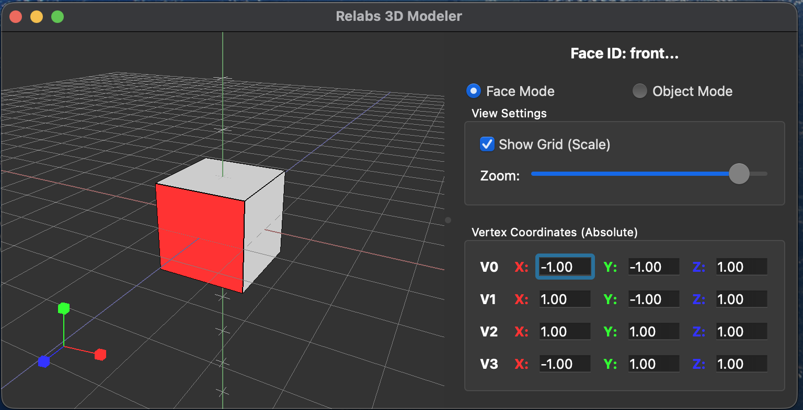

# Relabs - 3D Modeling Tool

Relabs is a lightweight, face-based 3D modeling tool written in Python. It focuses on intuitive manipulation of cubic structures with real-time synchronization between a 3D viewport and precise numerical controls.



## ✨ Features

*   **Face & Object Modeling**: Intuitive manipulation of 3D surfaces and whole-object translation.
*   **Real-time Synchronization**: Seamless update between the 3D viewport and the numerical control panel.
*   **Precise Control**: Edit vertex coordinates or object center directly with absolute precision.
*   **Visual Aids**: Color-coded coordinate axes gizmo, 3D grid with Y-scale indicators, and face highlighting.
*   **View Controls**: Intuitive zoom slider and grid toggle directly from the control panel.
*   **Export Support**: Export models to XML with flexible settings (Coordinate systems, Scope).
*   **Architecture**: Built with a robust MVC pattern and strict separation of concerns for maintainability.

## 🛠 Requirements

*   Python 3.8+
*   PySide6
*   PyOpenGL
*   numpy

## 🚀 Installation & Usage

1.  **Clone the repository:**
    ```bash
    git clone https://github.com/yourusername/Relabs.git
    cd Relabs
    ```

2.  **Install dependencies:**
    ```bash
    pip install -r requirements.txt
    ```

3.  **Run the application:**
    ```bash
    python main.py
    ```

## 🤖 AI-Human Collaboration

This project demonstrates **AI-Driven Development Level 3 (Autonomous Reasoning)**, where engineers and AI collaborate with an optimized division of labor throughout each phase.

| Phase | AI Role | Engineer Role | Description |
| :--- | :---: | :---: | :--- |
| **Requirements** | 30% | 70% | Human defines core requirements, AI structures the specifications. |
| **Architecture** | 80% | 20% | AI drafts the base structure, Human audits and approves. |
| **Implementation** | 100% | 0% | AI writes 100% of the code based on the approved manifest. |
| **Testing** | 50% | 50% | AI handles automated tests, Human focuses on qualitative UX verification. |
| **Debugging** | 60% | 40% | AI fixes logical bugs, Human resolves environment-specific issues. |

For a detailed analysis, please refer to [aidd_level_for_Relabs_report.md](./docs/history/aidd_level_for_Relabs_report.md).

## 🏗 Architecture

Relabs adheres to a strict "Architecture First" philosophy. The project is structured using a fractal architecture manifest system.

*   **[Core](./Core/)**: Pure data models and geometry logic. Independent of any UI framework.
*   **[UI](./UI/)**: Presentation layer built with PySide6 and OpenGL. Handles user interaction and rendering.
*   **[Service](./Service/)**: Application logic, including selection management and data export.

For more details on the design philosophy and architectural decisions, please refer to the [ARCHITECTURE_MANIFEST.md](./ARCHITECTURE_MANIFEST.md).

---

## License

This project is licensed under the MIT License - see the [LICENSE](LICENSE) file for details.

This project also relies on several open-source libraries. For full details on third-party licenses (NumPy, PyOpenGL, PySide6), please refer to the [THIRDPARTY_LICENSES.md](THIRDPARTY_LICENSES.md) file.

---

## Attribution

This project was created with the assistance of
[`CIP`](https://github.com/sirosiro/cip) (Core-Intent Prompting Framework),
a CC BY 4.0 licensed prompt framework for generative AI.